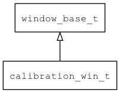

## calibration\_win\_t
### 概述


电阻屏校准窗口。

calibration\_win\_t是[window\_base\_t](window_base_t.md)的子类控件，
window\_base\_t的函数均适用于calibration\_win\_t控件。

在xml中使用"calibration\_win"标签创建电阻屏校准窗口。如：

```xml
<calibration_win name="cali" w="100%" h="100%" text="Please click the center of cross">
</calibration_win>
```

> 更多用法请参考：
[window.xml](https://github.com/zlgopen/awtk/blob/master/design/default/ui/calibration_win.xml)

在c代码中使用函数calibration\_win\_create创建窗口。如：

```c
widget_t* win = calibration_win_create(NULL, 0, 0, 320, 480);
```

通过calibration\_win\_set\_on\_done注册回调函数，用于保存校准数据。
----------------------------------
### 函数
<p id="calibration_win_t_methods">

| 函数名称 | 说明 | 
| -------- | ------------ | 
| <a href="#calibration_win_t_calibration_win_cast">calibration\_win\_cast</a> | 转换为calibration_win对象(供脚本语言使用)。 |
| <a href="#calibration_win_t_calibration_win_create">calibration\_win\_create</a> | 创建calibration_win对象 |
| <a href="#calibration_win_t_calibration_win_get_widget_vtable">calibration\_win\_get\_widget\_vtable</a> | 获取 calibration_win 虚表。 |
| <a href="#calibration_win_t_calibration_win_set_on_click">calibration\_win\_set\_on\_click</a> | 设置校准点击事件的处理函数。 |
| <a href="#calibration_win_t_calibration_win_set_on_done">calibration\_win\_set\_on\_done</a> | 设置校准完成的处理函数。 |
#### calibration\_win\_cast 函数
-----------------------

* 函数功能：

> <p id="calibration_win_t_calibration_win_cast">转换为calibration_win对象(供脚本语言使用)。

* 函数原型：

```
widget_t* calibration_win_cast (widget_t* widget);
```

* 参数说明：

| 参数 | 类型 | 说明 |
| -------- | ----- | --------- |
| 返回值 | widget\_t* | calibration\_win对象。 |
| widget | widget\_t* | calibration\_win对象。 |
#### calibration\_win\_create 函数
-----------------------

* 函数功能：

> <p id="calibration_win_t_calibration_win_create">创建calibration_win对象

* 函数原型：

```
widget_t* calibration_win_create (widget_t* parent, xy_t x, xy_t y, wh_t w, wh_t h);
```

* 参数说明：

| 参数 | 类型 | 说明 |
| -------- | ----- | --------- |
| 返回值 | widget\_t* | 对象。 |
| parent | widget\_t* | 父控件 |
| x | xy\_t | x坐标 |
| y | xy\_t | y坐标 |
| w | wh\_t | 宽度 |
| h | wh\_t | 高度 |
#### calibration\_win\_get\_widget\_vtable 函数
-----------------------

* 函数功能：

> <p id="calibration_win_t_calibration_win_get_widget_vtable">获取 calibration_win 虚表。

* 函数原型：

```
const widget_vtable_t* calibration_win_get_widget_vtable ();
```

* 参数说明：

| 参数 | 类型 | 说明 |
| -------- | ----- | --------- |
| 返回值 | const widget\_vtable\_t* | 成功返回 calibration\_win 虚表。 |
#### calibration\_win\_set\_on\_click 函数
-----------------------

* 函数功能：

> <p id="calibration_win_t_calibration_win_set_on_click">设置校准点击事件的处理函数。

* 函数原型：

```
ret_t calibration_win_set_on_click (widget_t* widget, calibration_win_on_click_t on_click, void* ctx);
```

* 参数说明：

| 参数 | 类型 | 说明 |
| -------- | ----- | --------- |
| 返回值 | ret\_t | 返回RET\_OK表示成功，否则表示失败。 |
| widget | widget\_t* | widget对象。 |
| on\_click | calibration\_win\_on\_click\_t | 回调函数。 |
| ctx | void* | 回调函数的上下文。 |
#### calibration\_win\_set\_on\_done 函数
-----------------------

* 函数功能：

> <p id="calibration_win_t_calibration_win_set_on_done">设置校准完成的处理函数。

* 函数原型：

```
ret_t calibration_win_set_on_done (widget_t* widget, calibration_win_on_done_t on_done, void* ctx);
```

* 参数说明：

| 参数 | 类型 | 说明 |
| -------- | ----- | --------- |
| 返回值 | ret\_t | 返回RET\_OK表示成功，否则表示失败。 |
| widget | widget\_t* | widget对象。 |
| on\_done | calibration\_win\_on\_done\_t | 回调函数。 |
| ctx | void* | 回调函数的上下文。 |
