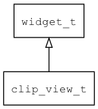

## clip\_view\_t
### 概述


一个裁剪子控件的容器控件。

它本身不提供布局功能，仅提供具有语义的标签，让xml更具有可读性。
子控件的布局可用layout\_children属性指定。
请参考[布局参数](https://github.com/zlgopen/awtk/blob/master/docs/layout.md)。

clip\_view\_t是[widget\_t](widget_t.md)的子类控件，widget\_t的函数均适用于clip\_view\_t控件。

在xml中使用"clip_view"标签创建clip_view，在clip_view控件下的所有子控件都会被裁剪。如下button控件会被裁剪，无法画出clip_view控件 ：

```xml
<clip_view x="0" y="0" w="100" h="100">
<button x="50" y="10" w="100" h="50" />
</clip_view>
```

备注：在clip_view控件下的所有子控件都会被裁剪，如果子控件本身会设置裁剪区的话，在子控件中计算裁剪区的交集，具体请参考scroll_view控件的scroll_view_on_paint_children函数。

可用通过style来设置控件的显示风格，如背景颜色等。如：

```xml
<style name="default" border_color="#a0a0a0">
<normal     bg_color="#f0f0f0" />
</style>
```
----------------------------------
### 函数
<p id="clip_view_t_methods">

| 函数名称 | 说明 | 
| -------- | ------------ | 
| <a href="#clip_view_t_clip_view_cast">clip\_view\_cast</a> | 转换为clip_view对象(供脚本语言使用)。 |
| <a href="#clip_view_t_clip_view_create">clip\_view\_create</a> | 创建clip_view对象 |
#### clip\_view\_cast 函数
-----------------------

* 函数功能：

> <p id="clip_view_t_clip_view_cast">转换为clip_view对象(供脚本语言使用)。

* 函数原型：

```
widget_t* clip_view_cast (widget_t* widget);
```

* 参数说明：

| 参数 | 类型 | 说明 |
| -------- | ----- | --------- |
| 返回值 | widget\_t* | clip\_view对象。 |
| widget | widget\_t* | clip\_view对象。 |
#### clip\_view\_create 函数
-----------------------

* 函数功能：

> <p id="clip_view_t_clip_view_create">创建clip_view对象

* 函数原型：

```
widget_t* clip_view_create (widget_t* parent, xy_t x, xy_t y, wh_t w, wh_t h);
```

* 参数说明：

| 参数 | 类型 | 说明 |
| -------- | ----- | --------- |
| 返回值 | widget\_t* | 对象。 |
| parent | widget\_t* | 父控件 |
| x | xy\_t | x坐标 |
| y | xy\_t | y坐标 |
| w | wh\_t | 宽度 |
| h | wh\_t | 高度 |
