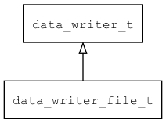

## data\_writer\_file\_t
### 概述


基于文件实现的 data_writer。通过 data_writer_factory 创建 writer 时，URL的格式如下：

```
file://filename
```
----------------------------------
### 函数
<p id="data_writer_file_t_methods">

| 函数名称 | 说明 | 
| -------- | ------------ | 
| <a href="#data_writer_file_t_data_writer_file_create">data\_writer\_file\_create</a> | 创建基于文件的data writer。 |
#### data\_writer\_file\_create 函数
-----------------------

* 函数功能：

> <p id="data_writer_file_t_data_writer_file_create">创建基于文件的data writer。

> 不要直接调用，而是注册到 data\_writer\_factory后，通过data\_writer\_factory调用

* 函数原型：

```
data_writer_t* data_writer_file_create (const char* filename);
```

* 参数说明：

| 参数 | 类型 | 说明 |
| -------- | ----- | --------- |
| 返回值 | data\_writer\_t* | 返回data writer对象。 |
| filename | const char* | 文件名。 |
