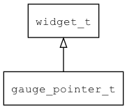

## gauge\_pointer\_t
### 概述


仪表指针控件。

仪表指针就是一张旋转的图片，图片可以是普通图片也可以是SVG图片。

在嵌入式平台上，对于旋转的图片，SVG图片的效率比位图高数倍，所以推荐使用SVG图片。

gauge\_pointer\_t是[widget\_t](widget_t.md)的子类控件，widget\_t的函数均适用于gauge\_pointer\_t控件。

在xml中使用"gauge\_pointer"标签创建仪表指针控件。如：

```xml
<gauge_pointer x="c" y="50" w="24" h="140" value="-128" image="gauge_pointer" />
```

> 更多用法请参考：
[gauge.xml](https://github.com/zlgopen/awtk/blob/master/design/default/ui/gauge.xml)

在c代码中使用函数gauge\_pointer\_create创建仪表指针控件。如：

```c
widget_t* gauge_pointer = gauge_pointer_create(gauge, 10, 10, 100, 30);
gauge_pointer_set_image(gauge_pointer, "gauge_pointer");
```

> 创建之后，需要用gauge\_pointer\_set\_image设置仪表指针图片。
----------------------------------
### 函数
<p id="gauge_pointer_t_methods">

| 函数名称 | 说明 | 
| -------- | ------------ | 
| <a href="#gauge_pointer_t_gauge_pointer_cast">gauge\_pointer\_cast</a> | 转换为gauge_pointer对象(供脚本语言使用)。 |
| <a href="#gauge_pointer_t_gauge_pointer_create">gauge\_pointer\_create</a> | 创建gauge_pointer对象 |
| <a href="#gauge_pointer_t_gauge_pointer_get_widget_vtable">gauge\_pointer\_get\_widget\_vtable</a> | 获取 gauge_pointer 虚表。 |
| <a href="#gauge_pointer_t_gauge_pointer_set_anchor">gauge\_pointer\_set\_anchor</a> | 设置指针的旋转锚点。 |
| <a href="#gauge_pointer_t_gauge_pointer_set_angle">gauge\_pointer\_set\_angle</a> | 设置指针角度。12点钟方向为0度，顺时钟方向为正，单位为度。 |
| <a href="#gauge_pointer_t_gauge_pointer_set_image">gauge\_pointer\_set\_image</a> | 设置指针的图片。 |
### 属性
<p id="gauge_pointer_t_properties">

| 属性名称 | 类型 | 说明 | 
| -------- | ----- | ------------ | 
| <a href="#gauge_pointer_t_anchor_x">anchor\_x</a> | char* | 图片旋转锚点x坐标。(后面加上px为像素点，不加px为相对百分比坐标0.0f到1.0f) |
| <a href="#gauge_pointer_t_anchor_y">anchor\_y</a> | char* | 图片旋转锚点x坐标。(后面加上px为像素点，不加px为相对百分比坐标0.0f到1.0f) |
| <a href="#gauge_pointer_t_angle">angle</a> | float\_t | 指针角度。12点钟方向为0度，顺时钟方向为正，单位为度。 |
| <a href="#gauge_pointer_t_image">image</a> | char* | 指针图片。 |
### 事件
<p id="gauge_pointer_t_events">

| 事件名称 | 类型  | 说明 | 
| -------- | ----- | ------- | 
| EVT\_VALUE\_WILL\_CHANGE | value\_change\_event\_t | 值(角度)即将改变事件。 |
| EVT\_VALUE\_CHANGED | value\_change\_event\_t | 值(角度)改变事件。 |
#### gauge\_pointer\_cast 函数
-----------------------

* 函数功能：

> <p id="gauge_pointer_t_gauge_pointer_cast">转换为gauge_pointer对象(供脚本语言使用)。

* 函数原型：

```
widget_t* gauge_pointer_cast (widget_t* widget);
```

* 参数说明：

| 参数 | 类型 | 说明 |
| -------- | ----- | --------- |
| 返回值 | widget\_t* | gauge\_pointer对象。 |
| widget | widget\_t* | gauge\_pointer对象。 |
#### gauge\_pointer\_create 函数
-----------------------

* 函数功能：

> <p id="gauge_pointer_t_gauge_pointer_create">创建gauge_pointer对象

* 函数原型：

```
widget_t* gauge_pointer_create (widget_t* parent, xy_t x, xy_t y, wh_t w, wh_t h);
```

* 参数说明：

| 参数 | 类型 | 说明 |
| -------- | ----- | --------- |
| 返回值 | widget\_t* | 对象。 |
| parent | widget\_t* | 父控件 |
| x | xy\_t | x坐标 |
| y | xy\_t | y坐标 |
| w | wh\_t | 宽度 |
| h | wh\_t | 高度 |
#### gauge\_pointer\_get\_widget\_vtable 函数
-----------------------

* 函数功能：

> <p id="gauge_pointer_t_gauge_pointer_get_widget_vtable">获取 gauge_pointer 虚表。

* 函数原型：

```
const widget_vtable_t* gauge_pointer_get_widget_vtable ();
```

* 参数说明：

| 参数 | 类型 | 说明 |
| -------- | ----- | --------- |
| 返回值 | const widget\_vtable\_t* | 成功返回 gauge\_pointer 虚表。 |
#### gauge\_pointer\_set\_anchor 函数
-----------------------

* 函数功能：

> <p id="gauge_pointer_t_gauge_pointer_set_anchor">设置指针的旋转锚点。

* 函数原型：

```
ret_t gauge_pointer_set_anchor (widget_t* widget, const char* anchor_x, const char* anchor_y);
```

* 参数说明：

| 参数 | 类型 | 说明 |
| -------- | ----- | --------- |
| 返回值 | ret\_t | 返回RET\_OK表示成功，否则表示失败。 |
| widget | widget\_t* | 控件对象。 |
| anchor\_x | const char* | 指针的锚点坐标x。(后面加上px为像素点，不加px为相对百分比坐标) |
| anchor\_y | const char* | 指针的锚点坐标y。(后面加上px为像素点，不加px为相对百分比坐标) |
#### gauge\_pointer\_set\_angle 函数
-----------------------

* 函数功能：

> <p id="gauge_pointer_t_gauge_pointer_set_angle">设置指针角度。12点钟方向为0度，顺时钟方向为正，单位为度。

* 函数原型：

```
ret_t gauge_pointer_set_angle (widget_t* widget, float_t angle);
```

* 参数说明：

| 参数 | 类型 | 说明 |
| -------- | ----- | --------- |
| 返回值 | ret\_t | 返回RET\_OK表示成功，否则表示失败。 |
| widget | widget\_t* | 控件对象。 |
| angle | float\_t | 指针角度。 |
#### gauge\_pointer\_set\_image 函数
-----------------------

* 函数功能：

> <p id="gauge_pointer_t_gauge_pointer_set_image">设置指针的图片。

* 函数原型：

```
ret_t gauge_pointer_set_image (widget_t* widget, const char* image);
```

* 参数说明：

| 参数 | 类型 | 说明 |
| -------- | ----- | --------- |
| 返回值 | ret\_t | 返回RET\_OK表示成功，否则表示失败。 |
| widget | widget\_t* | 控件对象。 |
| image | const char* | 指针的图片。 |
#### anchor\_x 属性
-----------------------
> <p id="gauge_pointer_t_anchor_x">图片旋转锚点x坐标。(后面加上px为像素点，不加px为相对百分比坐标0.0f到1.0f)

* 类型：char*

| 特性 | 是否支持 |
| -------- | ----- |
| 可直接读取 | 是 |
| 可直接修改 | 否 |
| 可持久化   | 是 |
| 可脚本化   | 是 |
| 可在IDE中设置 | 是 |
| 可在XML中设置 | 是 |
| 可通过widget\_get\_prop读取 | 是 |
| 可通过widget\_set\_prop修改 | 是 |
#### anchor\_y 属性
-----------------------
> <p id="gauge_pointer_t_anchor_y">图片旋转锚点x坐标。(后面加上px为像素点，不加px为相对百分比坐标0.0f到1.0f)

* 类型：char*

| 特性 | 是否支持 |
| -------- | ----- |
| 可直接读取 | 是 |
| 可直接修改 | 否 |
| 可持久化   | 是 |
| 可脚本化   | 是 |
| 可在IDE中设置 | 是 |
| 可在XML中设置 | 是 |
| 可通过widget\_get\_prop读取 | 是 |
| 可通过widget\_set\_prop修改 | 是 |
#### angle 属性
-----------------------
> <p id="gauge_pointer_t_angle">指针角度。12点钟方向为0度，顺时钟方向为正，单位为度。

* 类型：float\_t

| 特性 | 是否支持 |
| -------- | ----- |
| 可直接读取 | 是 |
| 可直接修改 | 否 |
| 可持久化   | 是 |
| 可脚本化   | 是 |
| 可在IDE中设置 | 是 |
| 可在XML中设置 | 是 |
| 可通过widget\_get\_prop读取 | 是 |
| 可通过widget\_set\_prop修改 | 是 |
#### image 属性
-----------------------
> <p id="gauge_pointer_t_image">指针图片。

图片须垂直向上，图片的中心点为旋转方向。

* 类型：char*

| 特性 | 是否支持 |
| -------- | ----- |
| 可直接读取 | 是 |
| 可直接修改 | 否 |
| 可持久化   | 是 |
| 可脚本化   | 是 |
| 可在IDE中设置 | 是 |
| 可在XML中设置 | 是 |
| 可通过widget\_get\_prop读取 | 是 |
| 可通过widget\_set\_prop修改 | 是 |
