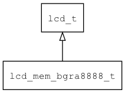

## lcd\_mem\_bgra8888\_t
### 概述



----------------------------------
### 函数
<p id="lcd_mem_bgra8888_t_methods">

| 函数名称 | 说明 | 
| -------- | ------------ | 
| <a href="#lcd_mem_bgra8888_t_lcd_mem_bgra8888_create">lcd\_mem\_bgra8888\_create</a> | 创建lcd对象。 |
| <a href="#lcd_mem_bgra8888_t_lcd_mem_bgra8888_create_double_fb">lcd\_mem\_bgra8888\_create\_double\_fb</a> | 创建double fb lcd对象。 |
| <a href="#lcd_mem_bgra8888_t_lcd_mem_bgra8888_create_single_fb">lcd\_mem\_bgra8888\_create\_single\_fb</a> | 创建single fb lcd对象。 |
| <a href="#lcd_mem_bgra8888_t_lcd_mem_bgra8888_create_three_fb">lcd\_mem\_bgra8888\_create\_three\_fb</a> | 创建three fb lcd对象。 |
| <a href="#lcd_mem_bgra8888_t_lcd_mem_bgra8888_init">lcd\_mem\_bgra8888\_init</a> | 创建lcd对象。 |
#### lcd\_mem\_bgra8888\_create 函数
-----------------------

* 函数功能：

> <p id="lcd_mem_bgra8888_t_lcd_mem_bgra8888_create">创建lcd对象。

* 函数原型：

```
lcd_t* lcd_mem_bgra8888_create (wh_t w, wh_t h, bool_t alloc);
```

* 参数说明：

| 参数 | 类型 | 说明 |
| -------- | ----- | --------- |
| 返回值 | lcd\_t* | 返回lcd对象。 |
| w | wh\_t | 宽度。 |
| h | wh\_t | 高度。 |
| alloc | bool\_t | 是否分配内存。 |
#### lcd\_mem\_bgra8888\_create\_double\_fb 函数
-----------------------

* 函数功能：

> <p id="lcd_mem_bgra8888_t_lcd_mem_bgra8888_create_double_fb">创建double fb lcd对象。

* 函数原型：

```
lcd_t* lcd_mem_bgra8888_create_double_fb (wh_t w, wh_t h, uint8_t* online_fb, uint8_t* offline_fb);
```

* 参数说明：

| 参数 | 类型 | 说明 |
| -------- | ----- | --------- |
| 返回值 | lcd\_t* | 返回lcd对象。 |
| w | wh\_t | 宽度。 |
| h | wh\_t | 高度。 |
| online\_fb | uint8\_t* | 在线帧率缓冲区。 |
| offline\_fb | uint8\_t* | 离线帧率缓冲区。 |
#### lcd\_mem\_bgra8888\_create\_single\_fb 函数
-----------------------

* 函数功能：

> <p id="lcd_mem_bgra8888_t_lcd_mem_bgra8888_create_single_fb">创建single fb lcd对象。

* 函数原型：

```
lcd_t* lcd_mem_bgra8888_create_single_fb (wh_t w, wh_t h, uint8_t* fbuff);
```

* 参数说明：

| 参数 | 类型 | 说明 |
| -------- | ----- | --------- |
| 返回值 | lcd\_t* | 返回lcd对象。 |
| w | wh\_t | 宽度。 |
| h | wh\_t | 高度。 |
| fbuff | uint8\_t* | 帧率缓冲区。 |
#### lcd\_mem\_bgra8888\_create\_three\_fb 函数
-----------------------

* 函数功能：

> <p id="lcd_mem_bgra8888_t_lcd_mem_bgra8888_create_three_fb">创建three fb lcd对象。

* 函数原型：

```
lcd_t* lcd_mem_bgra8888_create_three_fb (wh_t w, wh_t h, uint8_t* online_fb, uint8_t* offline_fb, uint8_t* next_fb);
```

* 参数说明：

| 参数 | 类型 | 说明 |
| -------- | ----- | --------- |
| 返回值 | lcd\_t* | 返回lcd对象。 |
| w | wh\_t | 宽度。 |
| h | wh\_t | 高度。 |
| online\_fb | uint8\_t* | 在线帧率缓冲区。 |
| offline\_fb | uint8\_t* | 离线帧率缓冲区。 |
| next\_fb | uint8\_t* | 待显示的帧率缓冲区。 |
#### lcd\_mem\_bgra8888\_init 函数
-----------------------

* 函数功能：

> <p id="lcd_mem_bgra8888_t_lcd_mem_bgra8888_init">创建lcd对象。

* 函数原型：

```
lcd_t* lcd_mem_bgra8888_init (lcd_mem_t* lcd, wh_t w, wh_t h, bool_t alloc);
```

* 参数说明：

| 参数 | 类型 | 说明 |
| -------- | ----- | --------- |
| 返回值 | lcd\_t* | 返回lcd对象。 |
| lcd | lcd\_mem\_t* | 对象。 |
| w | wh\_t | 宽度。 |
| h | wh\_t | 高度。 |
| alloc | bool\_t | 是否分配内存。 |
