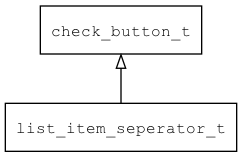

## list\_item\_seperator\_t
### 概述


list_item_seperator。
用来模拟实现风琴控件(accordion)和属性页分组控件。
> 当前控件被点击时，显示/隐藏当前控件到下一个分隔符控件之间的控件。
list_item_seperator\_t是[widget\_t](widget_t.md)的子类控件，widget\_t的函数均适用于list_item_seperator\_t控件。

在xml中使用"list_item_seperator"标签创建list_item_seperator。如：

```xml
<list_item_seperator radio="true" text="Group2" h="32"/>
<list_item style="empty" children_layout="default(r=1,c=0,ym=1)">
<label w="30%" text="ASCII"/>
<edit w="70%" text="" tips="ascii" input_type="ascii" focused="true" action_text="next"/>
</list_item>
<list_item style="empty" children_layout="default(r=1,c=0,ym=1)">
<label w="30%" text="Int"/>
<edit w="70%" text="" tips="int" input_type="int"/>
</list_item>

<list_item_seperator radio="true" text="Group3" h="32"/>
<list_item style="empty" children_layout="default(r=1,c=0,ym=1)">
<label w="30%" text="Float"/>
<edit w="70%" text="" tips="float" input_type="float"/>
</list_item>
<list_item style="empty" children_layout="default(r=1,c=0,ym=1)">
<label w="30%" text="UFloat"/>
<edit w="70%" text="" tips="unsigned float" input_type="ufloat"/>
</list_item>
```

可用通过style来设置控件的显示风格，如背景颜色等。如：

```xml
<list_item_seperator text_color="black" bg_color="#e0e0e0">
<style name="default" icon_at="left">
<normal  icon="collapse" />
<pressed icon="collapse" />
<over    icon="collapse" text_color="green"/>
<focused icon="collapse" text_color="green"/>
<normal_of_checked icon="expand" text_color="blue"/>
<pressed_of_checked icon="expand" text_color="blue"/>
<over_of_checked icon="expand" text_color="green"/>
<focused_of_checked icon="expand" text_color="green"/>
</style>
</list_item_seperator>
```
----------------------------------
### 函数
<p id="list_item_seperator_t_methods">

| 函数名称 | 说明 | 
| -------- | ------------ | 
| <a href="#list_item_seperator_t_list_item_seperator_cast">list\_item\_seperator\_cast</a> | 转换为list_item_seperator对象(供脚本语言使用)。 |
| <a href="#list_item_seperator_t_list_item_seperator_create">list\_item\_seperator\_create</a> | 创建list_item_seperator对象 |
#### list\_item\_seperator\_cast 函数
-----------------------

* 函数功能：

> <p id="list_item_seperator_t_list_item_seperator_cast">转换为list_item_seperator对象(供脚本语言使用)。

* 函数原型：

```
widget_t* list_item_seperator_cast (widget_t* widget);
```

* 参数说明：

| 参数 | 类型 | 说明 |
| -------- | ----- | --------- |
| 返回值 | widget\_t* | list\_item\_seperator对象。 |
| widget | widget\_t* | list\_item\_seperator对象。 |
#### list\_item\_seperator\_create 函数
-----------------------

* 函数功能：

> <p id="list_item_seperator_t_list_item_seperator_create">创建list_item_seperator对象

* 函数原型：

```
widget_t* list_item_seperator_create (widget_t* parent, xy_t x, xy_t y, wh_t w, wh_t h);
```

* 参数说明：

| 参数 | 类型 | 说明 |
| -------- | ----- | --------- |
| 返回值 | widget\_t* | 对象。 |
| parent | widget\_t* | 父控件 |
| x | xy\_t | x坐标 |
| y | xy\_t | y坐标 |
| w | wh\_t | 宽度 |
| h | wh\_t | 高度 |
