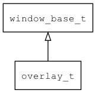

## overlay\_t
### 概述


overlay窗口。

overlay窗口有点类似于非模态的dialog，但是它位置和大小是完全自由的，窗口管理器不会对它做任何限制。

如果overlay窗口有透明或半透效果，则不支持窗口动画，但可以通过移动窗口位置来实现类似动画的效果。

overlay\_t是[window\_base\_t](window_base_t.md)的子类控件，window\_base\_t的函数均适用于overlay\_t控件。

在xml中使用"overlay"标签创建窗口。需要指定坐标和大小，可以指定窗体样式和动画名称。如：

```xml
<overlay theme="basic" x="100" y="100" w="200" h="300">
...
</overlay>
```

>
更多用法请参考：[overlay.xml](https://github.com/zlgopen/awtk/blob/master/design/default/ui/)

在c代码中使用函数overlay\_create创建窗口。如：

```c
widget_t* overlay = overlay_create(NULL, 100, 100, 200, 300);
```

> 完整示例请参考：[overlay
demo](https://github.com/zlgopen/awtk-c-demos/blob/master/demos/)

可用通过style来设置窗口的风格，如背景颜色或图片等。如：

```xml
<style name="bricks">
<normal bg_image="bricks"  bg_image_draw_type="repeat"/>
</style>
```

> 更多用法请参考：[theme
default](https://github.com/zlgopen/awtk/blob/master/design/default/styles/default.xml#L0)
----------------------------------
### 函数
<p id="overlay_t_methods">

| 函数名称 | 说明 | 
| -------- | ------------ | 
| <a href="#overlay_t_overlay_cast">overlay\_cast</a> | 转换为overlay对象(供脚本语言使用)。 |
| <a href="#overlay_t_overlay_create">overlay\_create</a> | 创建overlay对象 |
| <a href="#overlay_t_overlay_get_widget_vtable">overlay\_get\_widget\_vtable</a> | 获取 overlay 虚表。 |
| <a href="#overlay_t_overlay_set_always_on_top">overlay\_set\_always\_on\_top</a> | 设置是否总是在最上面。 |
| <a href="#overlay_t_overlay_set_click_through">overlay\_set\_click\_through</a> | 设置是否启用点击穿透。 |
| <a href="#overlay_t_overlay_set_modeless">overlay\_set\_modeless</a> | 设置是否非模态窗口模式。 |
### 属性
<p id="overlay_t_properties">

| 属性名称 | 类型 | 说明 | 
| -------- | ----- | ------------ | 
| <a href="#overlay_t_always_on_top">always\_on\_top</a> | bool\_t | 是否总在最上面。 |
| <a href="#overlay_t_click_through">click\_through</a> | bool\_t | 点击穿透。点击没有子控件的位置，是否穿透到底层窗口。 |
| <a href="#overlay_t_modeless">modeless</a> | bool\_t | 非模态窗口。 |
#### overlay\_cast 函数
-----------------------

* 函数功能：

> <p id="overlay_t_overlay_cast">转换为overlay对象(供脚本语言使用)。

* 函数原型：

```
widget_t* overlay_cast (widget_t* widget);
```

* 参数说明：

| 参数 | 类型 | 说明 |
| -------- | ----- | --------- |
| 返回值 | widget\_t* | overlay对象。 |
| widget | widget\_t* | overlay对象。 |
#### overlay\_create 函数
-----------------------

* 函数功能：

> <p id="overlay_t_overlay_create">创建overlay对象

* 函数原型：

```
widget_t* overlay_create (widget_t* parent, xy_t x, xy_t y, wh_t w, wh_t h);
```

* 参数说明：

| 参数 | 类型 | 说明 |
| -------- | ----- | --------- |
| 返回值 | widget\_t* | 对象。 |
| parent | widget\_t* | 父控件 |
| x | xy\_t | x坐标 |
| y | xy\_t | y坐标 |
| w | wh\_t | 宽度 |
| h | wh\_t | 高度 |
#### overlay\_get\_widget\_vtable 函数
-----------------------

* 函数功能：

> <p id="overlay_t_overlay_get_widget_vtable">获取 overlay 虚表。

* 函数原型：

```
const widget_vtable_t* overlay_get_widget_vtable ();
```

* 参数说明：

| 参数 | 类型 | 说明 |
| -------- | ----- | --------- |
| 返回值 | const widget\_vtable\_t* | 成功返回 overlay 虚表。 |
#### overlay\_set\_always\_on\_top 函数
-----------------------

* 函数功能：

> <p id="overlay_t_overlay_set_always_on_top">设置是否总是在最上面。

* 函数原型：

```
ret_t overlay_set_always_on_top (widget_t* widget, bool_t always_on_top);
```

* 参数说明：

| 参数 | 类型 | 说明 |
| -------- | ----- | --------- |
| 返回值 | ret\_t | 返回RET\_OK表示成功，否则表示失败。 |
| widget | widget\_t* | 控件对象。 |
| always\_on\_top | bool\_t | 是否总是在最上面。 |
#### overlay\_set\_click\_through 函数
-----------------------

* 函数功能：

> <p id="overlay_t_overlay_set_click_through">设置是否启用点击穿透。

* 函数原型：

```
ret_t overlay_set_click_through (widget_t* widget, bool_t click_through);
```

* 参数说明：

| 参数 | 类型 | 说明 |
| -------- | ----- | --------- |
| 返回值 | ret\_t | 返回RET\_OK表示成功，否则表示失败。 |
| widget | widget\_t* | 控件对象。 |
| click\_through | bool\_t | 是否启用点击穿透。 |
#### overlay\_set\_modeless 函数
-----------------------

* 函数功能：

> <p id="overlay_t_overlay_set_modeless">设置是否非模态窗口模式。

* 函数原型：

```
ret_t overlay_set_modeless (widget_t* widget, bool_t modeless);
```

* 参数说明：

| 参数 | 类型 | 说明 |
| -------- | ----- | --------- |
| 返回值 | ret\_t | 返回RET\_OK表示成功，否则表示失败。 |
| widget | widget\_t* | 控件对象。 |
| modeless | bool\_t | 是否非模态窗口模式。 |
#### always\_on\_top 属性
-----------------------
> <p id="overlay_t_always_on_top">是否总在最上面。

缺省不启用。

* 类型：bool\_t

| 特性 | 是否支持 |
| -------- | ----- |
| 可直接读取 | 是 |
| 可直接修改 | 否 |
| 可持久化   | 是 |
| 可脚本化   | 是 |
| 可在IDE中设置 | 是 |
| 可在XML中设置 | 是 |
| 可通过widget\_get\_prop读取 | 是 |
| 可通过widget\_set\_prop修改 | 是 |
#### click\_through 属性
-----------------------
> <p id="overlay_t_click_through">点击穿透。点击没有子控件的位置，是否穿透到底层窗口。

缺省不启用。

* 类型：bool\_t

| 特性 | 是否支持 |
| -------- | ----- |
| 可直接读取 | 是 |
| 可直接修改 | 否 |
| 可持久化   | 是 |
| 可脚本化   | 是 |
| 可在IDE中设置 | 是 |
| 可在XML中设置 | 是 |
| 可通过widget\_get\_prop读取 | 是 |
| 可通过widget\_set\_prop修改 | 是 |
#### modeless 属性
-----------------------
> <p id="overlay_t_modeless">非模态窗口。

缺省不启用。

* 类型：bool\_t

| 特性 | 是否支持 |
| -------- | ----- |
| 可直接读取 | 是 |
| 可直接修改 | 否 |
| 可持久化   | 是 |
| 可脚本化   | 是 |
| 可在IDE中设置 | 是 |
| 可在XML中设置 | 是 |
| 可通过widget\_get\_prop读取 | 是 |
| 可通过widget\_set\_prop修改 | 是 |
